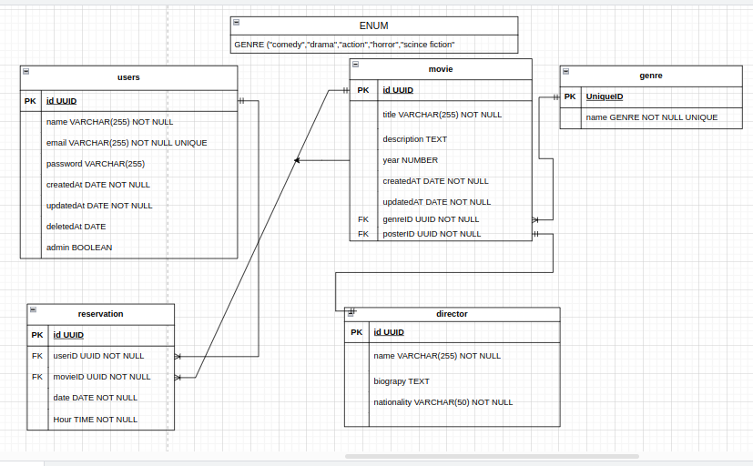

# backend-challenge-mks

<h1>API para cadastrar usuários,filmes, categorias e realizar reservas</h1>

<h3>Descrição da aplicação:</h3>

Construí uma API para um sistema de cinema de condomínio, que oferece aos moradores a oportunidade de desfrutar de uma experiência cinematográfica exclusiva e confortável diretamente em seus condomínios.

Com essa aplicação, os usuários podem se cadastrar facilmente, selecionar o filme que desejam assistir e escolher o horário mais conveniente para a sessão. O sistema foi projetado para proporcionar uma experiência de cinema privativa, permitindo que os moradores assistam aos seus filmes favoritos sem sair do conforto de suas casas.

Essa solução inovadora transforma o espaço do condomínio em um verdadeiro cinema particular, oferecendo entretenimento de alta qualidade de maneira prática e acessível para todos os residentes.. 

 

<h3>Tecnologias:</h3>

Nesta API, utilizei o TYPEORM  como ORM para fazer a interação com o banco de dados, serialização de dados com ZOD, utilização de postgresql como banco de dados, json web token para gerar tokens criptografados, dotenv para proporcionar a segurança dos dados sensíveis,bcrypt js para executar o hash da senha e express-async-errors para personalizar os erros na aplicação

<h2>Endpoints da API:</h2>

| Método | Endpoint                     | Descrição                                                  | Autenticação e Autorização               |
| ------ | ---------------------------- | ---------------------------------------------------------- | ---------------------------------------- |
| GET    | /user                        | Retorna todos os usuários cadastrados                      | Apenas administradores                   |
| GET    | /user/{id}                   | Retorna um usuário específico pelo ID                      | Admins e donos da conta                  |
| POST   | /user                         | Cadastra um novo usuário                                 | Qualquer usuário, token não é necessário |
| PATCH  | /user/{id}                   | Atualiza os dados de um usuário específico                 | Admins e donos da conta                  |
| DELETE | /user/{id}                    | Realiza um soft delete no usuário                       | Admins e donos da conta                  |
| POST   | /login                       | Gerar um token de autenticação                             | Qualquer usuário, token não é necessário |
| POST   | /genre                      | Criação de um genêro para o filme                           | Apenas administradores                   |
| GET    | /genre                  | Lista todos os genêros do filme                                 | Qualque usuário logado   |
| GET    | /genre /{id}/movie     | Listar todos os filmes que pertencem a um genêro                 | Qualquer usuário logado  |
| POST   | /movie               | Cria um filme                                                      | Apenas administradores                   |
| GET    | /movie                | Lista todos os filmes                             | Qualquer usuário logado |
| GET    | /movie/${id}            | Lista todos os filmes   por id                           | Qualquer usuário logado |
| PATCH   | /movie/${id}           | Atualiza um  filmes   por id                           | Apenas Administradores|
| DELETE   | /movie/${id}          | Deleta um  filmes   por id                           | Apenas Administradores|
| POST   | /reservation            | Agenda um filme para assistir no cinema privativo    | Qualquer usuário logado   |
| GET    | /reservation/movie/{id}    | Lista todos as reservas do cinema privativo para cada filme               | Apenas Administradores                   |

## Diagrama de Entidades e Relacionamentos:

<h2>Algumas Regras de negócio</h2>

<ul>

<li>Implementei uma regra que permite reservas ao cinema privativo  apenas durante um determinado horário (8h às 23h), garantindo uma experiência conveniente e segura para todos os envolvidos.</li>
<li/>As reservas só podem ser realizadas de terça á domingo</li>
  <li>Em função do caráter privativo do cinema, não podem ser realizadas reservas no mesmo horário por usuários diferentes</li>
<li>Usuários não podem ser cadastrados com o mesmo e-mail </li>
<li>Um filme só pode ser cadastrado em um ano atual ou passado/li>
<li>Filmes não podem ser cadastrados com o mesmo título</li>

</ul>

<h2>Passos para a API rodar:</h2>

<ul>
<li>
Clone o reposítório de forma local
</li>
<li>Utilize o comando npm install para instalar todas as dependências</li>
<li>Utilize o comando npm run typeorm migration:run -- -d ./src/data-source para rodar as migrações </li>
<li>Para rodar o servidor, utilize o npm run dev</li>
<li>Para um melhor entendimento a respeito da API e de cada rota, acesse a documentação em: https://backend-challenge-mks-h3l5.onrender.com/api-documentation/ </li>
</ul> 
